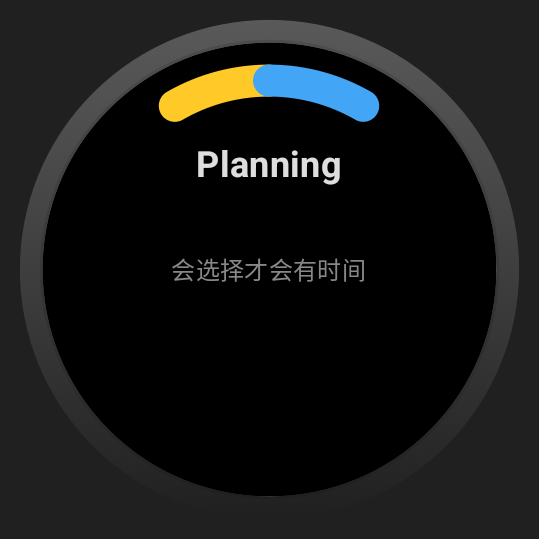

# TimeTagger

> Give your time a label — explore your day in a single sentence.

---

## Inspiration

When preparing for exams, I often felt my time slipping away in fragments:
daydreaming, scrolling on my phone, notifications, calls from friends...
I wanted to know **where all my time went**, but I didn’t have a personal assistant to track it.

Self-monitoring is hard.
I tried several methods:

* Timer + pen and paper — too cumbersome.
* Pomodoro apps — not helpful; picking up the phone easily leads to distractions.

Just when I was stuck, I read a report about *Time Labeling* —

> Why not label your time?

That’s how **TimeTagger** was born.

---

## Core Idea

Raise your wrist and say a sentence.
The watch records the start of that time segment
— quietly tagging each moment.

More convenient than pen and paper.
More focused than a phone.
Unified logging, minimal interaction, purely local storage.
Want to export or analyze later? That’s all extendable.

---

## How to Use

1. Install the app on your Wear OS watch.
2. Open the app or tap the Tile.
3. Speak your current activity.
4. The system automatically records the time span and label.
5. Tap the clock to view today's activity log.

---

## Screenshots

---

## Future Plans

A **basic** time tracker for now.
When there’s time, I’d like to add:

1. Time analysis & visualization
2. Sync between phone and watch
3. Custom labels
4. Smart scheduling / remote reminders
5. Time-block journaling
6. Sharing logs or time-management summaries

---

Let every minute be seen.
Let time leave its trace.
